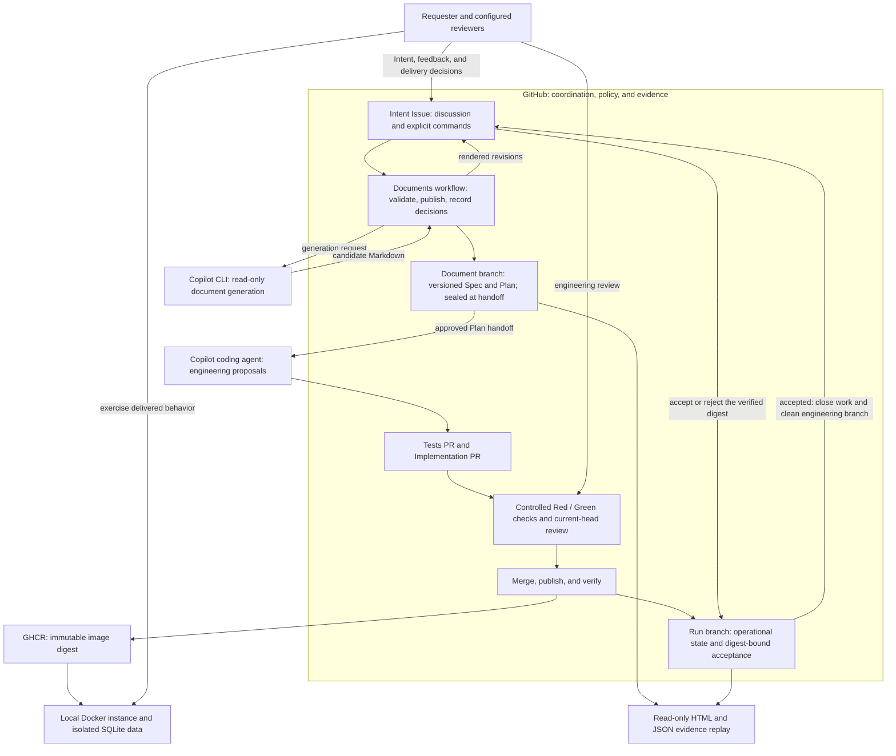
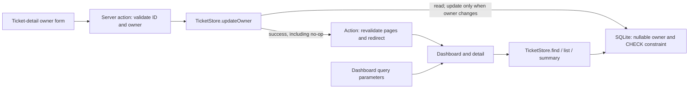
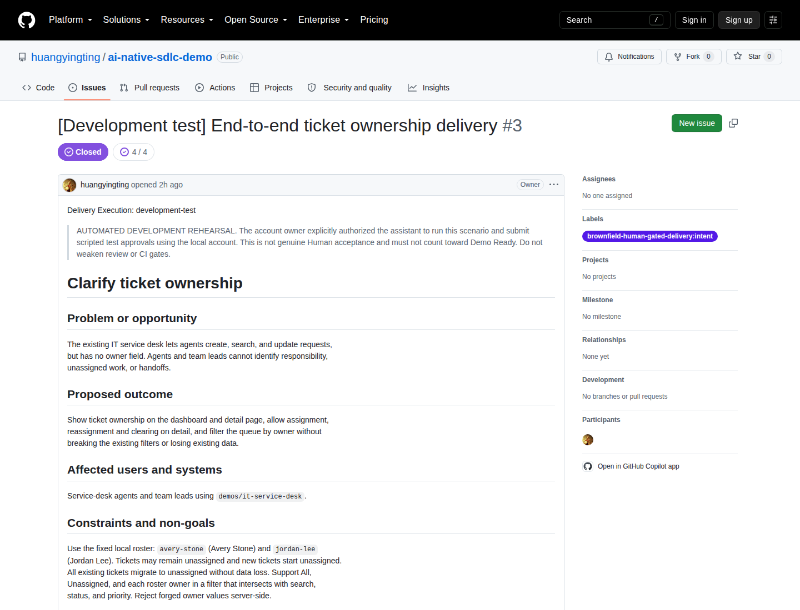
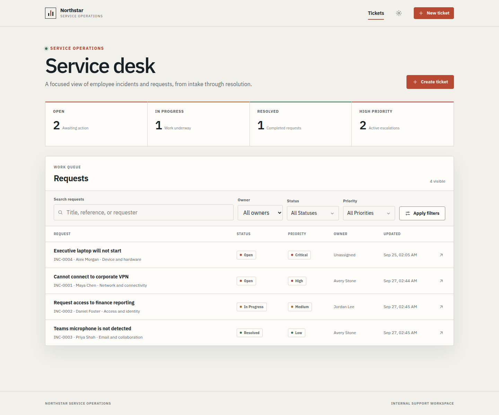
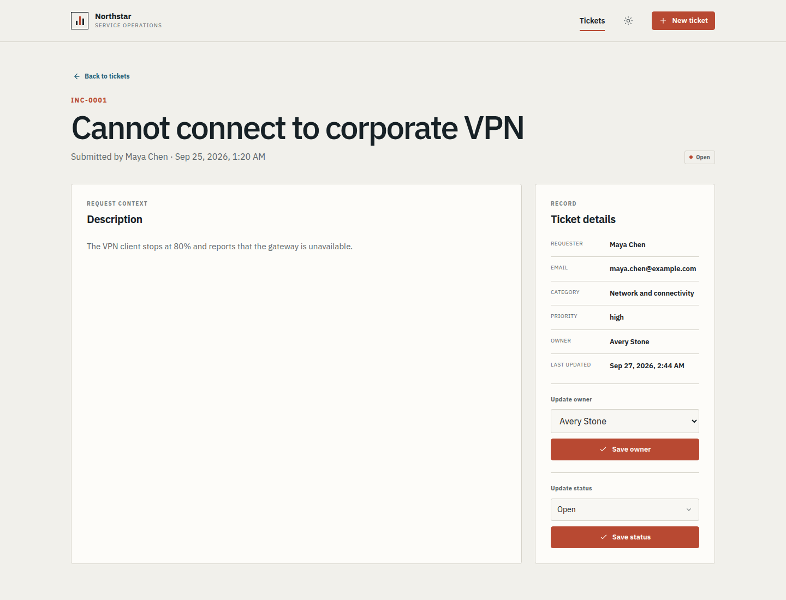
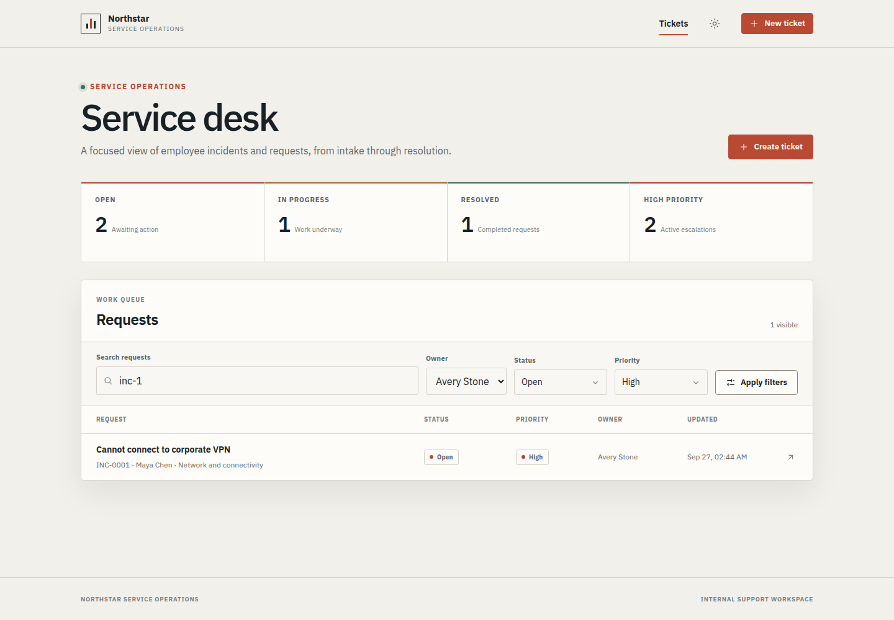

# Case study: ticket ownership from Intent to verified delivery

**Observed on:** September 27, 2026\
**Application:** Northstar IT Service Desk, an existing Next.js/SQLite application\
**Run:** [huangyingting/ai-native-sdlc-demo#3][intent]

> **Evidence boundary:** this was a real GitHub execution in
> `development-test` mode. The account owner explicitly authorized the assistant
> to operate the local account and submit scripted development-test approvals.
> The workflows, agent work, tests, merges, image publication, and runtime
> observations actually occurred. The approvals were **not independent Human
> review**. This run does not count as genuine Human acceptance or **Demo Ready**.

This case study connects the architecture, decisions, working application, and
evidence from one completed rehearsal. For instructions rather than a historical
account, use the [presenter walkthrough][walkthrough]. For policy and configuration,
use the [technical reference][reference].

**Reading map:** [Architecture](#2-architecture-and-github-customization) |
[Delivery story](#3-the-actual-delivery-story) |
[Screenshots](#4-the-delivered-application) |
[Evidence](#5-what-the-acceptance-evidence-proves) |
[Failures and fixes](#6-failures-that-improved-the-system) |
[Presentation and reproduction](#7-how-to-present-or-reproduce-the-result)

## 1. What this demo demonstrates

The business request was small: let service-desk agents see who owns a ticket,
transfer responsibility, and find unassigned work. The delivery problem was
larger: use AI to evolve an existing application while keeping requirements,
approvals, tests, code, and the delivered artifact traceable.

| Before | Delivered increment |
|---|---|
| Tickets had no ownership model | Nullable owner, with Avery Stone and Jordan Lee as the fixed roster |
| Responsibility was invisible in the queue and detail page | An owner column and detail metadata |
| Agents could update status but not responsibility | Assign, reassign, and clear ownership on ticket detail |
| Search intersected status and priority only | Owner filtering intersects the existing filters |
| Existing SQLite records needed to survive the change | Additive migration, preserved original fields, and write-free no-op updates |

Authentication, external directories, free-text owners, team ownership, SLAs,
notifications, and ownership fields on the creation form were explicitly outside
scope. The fixed [scenario manifest][scenario] and [acceptance checklist][checklist]
made those boundaries concrete.

The result is not "AI wrote a feature in one prompt." It is a delivery process
in which proposals can be revised, weak tests can be rejected, checks can block
progress, failures can be repaired, and the final decision names an exact image.

### Where the other repository demos fit

- **IT service desk:** the existing application being changed in this case.
- **Brownfield Human-Gated Delivery:** the GitHub lifecycle coordinating that change.
- **Brownfield demo toolkit:** isolated preparation, preflight, local image
  presentation, evidence replay, and the three-run readiness gate.
- **[Agent orchestration patterns][patterns] and [trace viewer][trace-viewer]:**
  separate demonstrations of direct execution, parallel delegation,
  critic-reviser loops, sequential pipelines, and trace inspection. This case
  does not claim that all of those patterns or a trace-viewer deployment were
  exercised by this delivery run.

## 2. Architecture and GitHub customization

GitHub was both the collaboration surface and the durable evidence store.
No additional document-review application was introduced.



In a normal run, the requester and reviewers make their own decisions. In this
rehearsal, their interactions were explicitly authorized scripted test actions.
The architecture diagram describes responsibilities, not evidence of independent
reviewer participation.

### Why these GitHub surfaces were chosen

| Surface | Responsibility and reason |
|---|---|
| Parent Intent Issue | Keep the problem, open questions, rendered Spec/Plan revisions, commands, and progress together |
| Custom `/sdlc` commands | Make transitions explicit; ordinary discussion and `@copilot` mentions are not document approvals |
| Document branch | Preserve version/hash-bound approval snapshots independently of an editable discussion |
| Tests PR | Review the executable contract and controlled Red without allowing production implementation |
| Implementation PR | Review the actual code increment against the frozen documents and approved tests |
| GitHub Actions and required checks | Enforce scope, artifact preservation, Red/Green rules, and merge policy |
| GHCR | Identify what was delivered by digest, not by a mutable tag |
| Operational run branch | Track pause/resume, verification attempts, and acceptance without rewriting the sealed contract |

**Spec and Plan are not application builds.** Their workflow validates document
structure and scope. Application tests, lint, builds, and container checks belong
to the engineering/delivery stages. This separation avoids meaningless normal
CI on document-only reviews.

The customization lives in the existing [workflow files][workflows] and
[lifecycle scripts, prompts, and tests][lifecycle]. Demo-specific scenarios stay
inside the [application's automation directory][scenario-directory]. The
[toolkit][toolkit] is a separate reusable utility, not an application dependency.

### Application request and storage path

The delivered application has a separate, much smaller architecture than the
GitHub delivery system:



- **Validation:** the server action validates a positive ticket ID and an owner
  from the fixed roster, or an empty form value. The store independently rejects
  invalid non-null owners; SQLite also constrains persisted owner values.
- **Normalization:** an empty ownership form value becomes database `null`.
  In the dashboard filter, an empty selection instead means **All owners**;
  the explicit `unassigned` filter means `owner IS NULL`.
- **Migration:** store initialization checks the existing schema and adds the
  nullable column in a transaction only when absent. It does not recreate the
  tickets or rewrite their original timestamps.
- **No-op and timestamps:** an already-current owner returns before any
  `UPDATE`. A changed owner updates only `owner` and `updated_at`, using a
  nondecreasing timestamp; invalid persisted timestamps raise an error.
- **Read behavior:** owner, status, priority, and search predicates intersect.
  The overview uses an unfiltered summary query, explaining why filtering the
  queue does not change the summary cards.

The change map below links to the **delivered demo at merge `0ef94e0...`**,
not the ownership-free source checkout. Paths are relative to
`demos/it-service-desk/`.

| File | Ownership responsibility |
|---|---|
| [`src/lib/ticket.ts`][app-model] | Shared roster, owner types, labels, and mutation schema |
| [`src/lib/ticket-store.ts`][app-store] | Migration, database constraints, filtering, storage validation, and write-free no-ops |
| [`src/app/actions.ts`][app-actions] | Validate submitted values, normalize Unassigned, report missing tickets, revalidate, and redirect |
| [`src/app/page.tsx`][app-dashboard] | Owner column, combined query filters, and owner-select state across navigation |
| [`src/app/tickets/[id]/page.tsx`][app-detail] | Persisted owner metadata and the labeled ownership form, separate from status updates |

### Trust boundaries

1. Copilot CLI generates candidate documents without the write-enabled
   `COPILOT_ASSIGN_TOKEN`. Trusted workflow code validates and publishes them.
2. Coding Agent proposes changes on PR branches. It does not approve itself.
3. Approval records bind the reviewed document version/hash or PR head, rather
   than authorizing whatever a branch contains later.
4. Document and run ledgers are checked against trusted workflow-bot identity
   and Git commit/content hashes. Missing attested state fails explicitly.
5. Successful image verification leaves an Issue-based run **awaiting
   acceptance**. Acceptance must name the current verified digest and attempt.

The demo repository used explicit **single-owner mode**: zero native required
PR approvals, with the configured custom current-head review policy and
required checks retained. That is not independent two-person review. Repository
setup and workflow authorization were still real prerequisites.

## 3. The actual delivery story

### A. Start from an ownership-free application

An isolated demo repository was prepared from source commit
[`5dbdc035cd357ab9ee3713493402919a70746440`][original-source].
Its initial repository baseline was
[`a619937b78e95443fdd0b4932ce7269fe4029efc`][baseline].
The [export provenance][provenance] records the source commit, scenario,
reviewer, and single-owner choice.

The exported scenario was `ownership-standard`. The subsequent run also
exercised revision and recovery paths; that does **not** make it three
independent scenario runs.

The source repository stayed ownership-free so it could prepare future demos.
The ownership implementation landed in the separate demo repository.

### B. Review documents before asking for implementation

The [Intent][intent] described the outcome and constraints rather than
prescribing a patch. AI generated full Spec and Plan revisions on that Issue.

The important sequence was:

1. Spec v1 was [approved][spec-v1-approval] and Plan v1 was generated.
2. A [Spec revision request][spec-revision] clarified that clearing the
   **owner filter** means selecting All owners while retaining the existing
   search/status/priority selections. It does not clear a ticket's assigned owner.
3. Spec v2 replaced v1, invalidating its approval and the earlier Plan. A stale
   [`/sdlc approve spec v1` command][stale-approval] was explicitly
   [rejected by the workflow][stale-rejection].
4. [Plan revision feedback][plan-revision] resolved questions before approval:
   unchanged owners are write-free successful no-ops; empty form values mean
   Unassigned/database `null`; invalid owners and missing tickets surface errors.
5. [Spec v2][spec] and [Plan v3][plan] received their
   [version-specific Spec approval][spec-v2-approval] and
   [Plan approval][plan-v3-approval], then were
   [sealed at commit `4d9bef47...`][contract].

This is the key document-review demonstration: feedback changes a versioned
contract, and an earlier approval cannot silently authorize a different one.

### C. Review whether Red is meaningful

Coding Agent opened the [Tests PR][tests-pr]. Review found that whole-page
owner-name assertions could pass simply because the names appeared in select
options. Storage-boundary rejection coverage and no-op write observation also
needed strengthening.

The revised tests checked actual ticket metadata/rows, compared stored records
around rejected mutations, and used an independent SQLite connection's
`PRAGMA data_version` to detect writes. A timestamp-only comparison would have
missed writes within the same clock tick.

The [controlled-Red run, attempt 2][red-ci], produced
**11 expected assertion failures and 27 passes**,
with no skipped or pending tests. The trusted Red validator, lint, and build
passed. This was an expected missing-capability result, not a broken import,
collection error, or infrastructure failure presented as TDD.

### D. Treat Green as necessary, not sufficient

The [Implementation PR][implementation-pr] added storage migration, server
validation, detail controls, and the dashboard filter. Review required removal
of a hidden option-label span added to satisfy static assertions, preservation
of the existing lockfile, and stronger timestamp handling.

Browser testing then found a regression that the first Green run missed:
navigating from an owner-filtered URL back to Tickets showed all rows, but the
uncontrolled select still displayed Avery Stone. The correction was tested
through actual navigation and a [same-root rerender regression][navigation-test].
[Timestamp regressions][timestamp-tests] also cover future-dated and invalid
persisted timestamps.

The final application had **41 passing tests**, plus successful lint, build,
and container smoke checks. Approved document and test blobs remained unchanged.
The implementation merged normally as
[`0ef94e0deb685136102ca8ac5351d53e565e2efc`][implementation-merge].

### E. Deliver an artifact, then exercise it

The [Publish workflow, attempt 2][publish-run], built and verified the actual
GHCR image. The artifact was pulled locally by its full digest, not rebuilt
from a possibly different checkout:

```text
ghcr.io/huangyingting/ai-native-sdlc-demo-it-service-desk@sha256:b5bbac8a0776c782f279a9857cce1d4db37849c3b23a75bfe0797d184a54e16e
```

The Intent stayed open after image verification. Runtime observations included
assignment/reassignment/clearing, detail and dashboard reloads, persistence
across a same-volume restart, exact filter result sets, and new-ticket behavior.

Pause/resume was also exercised: pause blocked new work and auto-merge;
resume restored orchestration. It did not terminate an already-running agent
or undo previous work.

### F. Record the decision, then reconcile completion

The [scripted development acceptance][acceptance] named the digest and actual
observations. Its durable decision survived a later cleanup failure.

That failure exposed a real API mismatch: GitHub REST version `2026-03-10`
omits `merge_commit_sha` from PR responses. Completion was corrected to verify
the PR's actual `merged` timeline event and its `commit_id`. It did not substitute
the current main tip or the PR's final source commit.

After the fix, [reconciliation succeeded][cleanup-run]. The Intent and all four
stage Issues closed, the engineering branch was removed, and the document and
run branches remained. A [second reconciliation][idempotence-run] succeeded
without another approval or a change to the accepted run-record commit.



*Follow-up capture of the real public Intent after completion. The Closed badge
is an observed workflow result, not proof of independent Human acceptance.*

## 4. The delivered application

**Screenshot provenance:** captured on September 27, 2026, after the original
rehearsal. The three application images below use the exact published digest in
a separate disposable Docker instance with fresh seed data. Owners were set
through the actual UI to reproduce the AC-3 fixture. They are not mockups or
screenshots taken at the original acceptance moment. They do not independently
prove migration, restart persistence, or Human sign-off.

The retained rehearsal instance and its AC-5 data were not modified for these
captures. Fixture names and `example.com` addresses are synthetic demo data.

### Queue: responsibility is visible without changing the original summary



*INC-0001 and INC-0003 belong to Avery; INC-0002 to Jordan; INC-0004 remains
Unassigned. The overview remains 2 open, 1 in progress, 1 resolved, and 2 active
high/critical tickets.*

### Detail: ownership is an explicit operation



*The persisted owner appears separately from the editable control. Status
updates remain a distinct operation.*

### Filter intersection: test identities, not only counts



*This query returns exactly INC-0001. The overview is unchanged by queue
filtering; clearing the owner filter must not clear the ticket's owner.*

## 5. What the acceptance evidence proves

The [recorded observations][acceptance] distinguish browser/runtime checks from
automated tests. The original AC-3 observations used exactly four tickets;
AC-5 used a separate fresh dataset, so its fifth ticket did not contaminate
those result sets.

| Criterion | Observed evidence | What must not be inferred |
|---|---|---|
| AC-1: preserve existing data | [Storage tests][storage-tests] exercised a persisted old-schema database, compared original records/timestamps, and tested idempotent migration. Fresh-container probes independently verified the four original seed records. | Fresh seeding or a screenshot alone does not prove migration. |
| AC-2: assignment and persistence | Actual UI assignment to Avery, reassignment to Jordan, clearing, and detail/dashboard reloads. A later Avery assignment and exact `updated_at` survived a restart with the same volume. | Cleanup/reseeding would not be persistence evidence; neither occurred between restart observations. |
| AC-3: intersect filters | All = {0001,0002,0003,0004}; Avery = {0001,0003}; Jordan = {0002}; Unassigned = {0004}. Avery + open + high + `inc-1` = {0001}; Avery + critical = {}. Clearing owner retained the exact raw search text `"  inc-1  "`, status, and priority. | Correct counts alone do not establish the correct tickets or preserved filter state. |
| AC-4: accessible controls and rejected writes | Keyboard-operated labeled owner/filter controls. Real [storage][storage-tests] and [server/UI tests][ui-tests] covered invalid roster values and missing ticket IDs without mutation. | No separate forged HTTP request against the production container was performed. This is not a full accessibility or security audit. |
| AC-5: preserve existing workflows | On a separate fresh dataset, created `Ownership demo request` using the exact manifest fields. SQL and UI verified initial open/Unassigned state; status changed to in-progress and combined search returned only INC-0005. | The extra ticket is not part of AC-3. No owner input was added to the creation form. |

### Curated evidence links

| Evidence | Source |
|---|---|
| Intent and complete discussion | [huangyingting/ai-native-sdlc-demo#3][intent] |
| Revision and stale-approval handling | [Spec feedback][spec-revision], [stale command][stale-approval], [rejection receipt][stale-rejection] |
| Final version-specific document approvals | [Spec v2 approval][spec-v2-approval], [Plan v3 approval][plan-v3-approval] |
| Frozen document contract | [Spec v2][spec], [Plan v3][plan], [approval-state JSON][contract] |
| Tests and implementation reviews | [huangyingting/ai-native-sdlc-demo#10][tests-pr], [huangyingting/ai-native-sdlc-demo#11][implementation-pr] |
| Controlled Red and its trusted validator | [Red run, attempt 2][red-ci]; [`tdd-red` job][red-job] and `stage-validation` passed |
| Final-head artifact preservation and Green checks | [Stage CI][stage-ci] |
| Application tests, lint, build, and container smoke | [IT Service Desk CI][app-ci] |
| Published digest and verification attempt | [Publish run 36286787715, attempt 2][publish-run] |
| Explicit digest-specific observations | [Development acceptance comment 5851863733][acceptance] |
| Durable accepted state | [Run record at `639c27e43a3acf1699d2b39a83c78d7dc07cbbbd`][run-record] |
| Recovered and repeatable cleanup | [Recovery run][cleanup-run], [idempotence run][idempotence-run] |
| Source automation/toolkit verification after fixes | [Repository CI: 237 tests across the root suites][source-ci] |

The durable record binds implementation merge `0ef94e0...`, Publish run
`36286787715`, attempt `2`, the image digest, and acceptance comment `5851863733`.
There is exactly one acceptance in that record.

The final read-only replay reported this combination:

```json
{
  "mode": "read-only-replay",
  "live": false,
  "recordTrusted": true,
  "executionMode": "development-test",
  "runtimeStatus": "accepted",
  "acceptance": {
    "complete": false,
    "reasons": [
      "Automated development tests do not constitute genuine Human acceptance or Demo Ready."
    ]
  }
}
```

`accepted` is the recorded result of the authorized development exercise.
`acceptance.complete: false` is the intended exclusion from genuine Human
acceptance. These values are not contradictory, and the case study must not
turn the second into `true`.

## 6. Failures that improved the system

The run was not an uninterrupted happy path. The most useful demo moments
were the failures that exposed gaps between mocked tests and real execution.

| Observed problem | Correction and lesson |
|---|---|
| CLI initialization stalled with an unsettled top-level await | Removed the cyclic CLI-entrypoint await and added child-process regression tests. See the [failed kickoff][kickoff-failure] and [maintenance fix][cli-fix]. Imported-function tests alone had missed it. |
| Valid generated Markdown failed the nonempty-section check | Reused the section parser rather than a regex that rejected blank lines after headings. See the [failed document run][document-failure] and [fix][document-fix]. |
| Copilot could not reliably update mandatory PR metadata | The authorized operator restored known stage metadata and removed closing keywords. This remained an explicit intervention, not an invented classification or silent policy bypass. |
| Copilot workflows ended as `action_required` | An authorized owner reran the specific workflows after review. The newest required suite mattered; an older successful suite on the same head was insufficient. |
| Static tests missed stale owner-select state during navigation | Reproduced it in a browser, corrected the control, and added a same-root navigation regression in the [implementation][implementation-pr]. |
| Docker's current missing-volume error differed from the mock | Recognized the exact resource-specific response while preserving permission/daemon failures. See [maintenance work][runtime-fix]. |
| Toolkit tests assumed the checkout still lacked ownership | Injected synthetic test baselines without changing production fingerprints. The same suites now run before and after feature delivery. See [maintenance work][runtime-fix]. |
| Acceptance was stored, but cleanup could not corroborate the merge | Replaced the removed REST field with actual merged timeline evidence. Preserved the decision and retried cleanup. See the [failed acceptance workflow][acceptance-failure] and [fix][merge-fix]. |
| A closed PR's successful Publish run had an empty PR-association array | Replay now verifies the exact head SHA, source branch, and source repository for that case. Conflicting associations and missing evidence still fail. See the [replay fix][replay-fix]. |

The operator did not force-merge, disable required checks, or reset approved
artifacts to get through these failures. Infrastructure failure was never
reclassified as expected Red.

## 7. How to present or reproduce the result

### A short, evidence-led presentation

This is a suggested **presentation order**, not the measured duration of
the original execution.

| Segment | Show | Explain |
|---|---|---|
| Business context | Intent and queue screenshot | A modest brownfield request with explicit non-goals |
| Design review | Spec v2, Plan v3, and recorded revisions | Why a changed document invalidates earlier approval |
| Executable contract | Tests PR and Red evidence | Why assertion quality matters more than simply having failing tests |
| Working increment | Implementation review and actual digest | Why Green still needs browser and persistence checks |
| Operational recovery | One failed workflow and its fix | Why recovery must preserve prior decisions and evidence |
| Completion | Acceptance comment, run record, and replay | Why merged code, a green workflow, or a closed Issue alone is insufficient |

For a prerecorded or offline presentation, label screenshots and replay as
historical evidence. Do not describe them as a new live execution. AI generation,
review iterations, and workflow authorization take variable time; do not promise
that the full workflow completes within a short presentation slot.

**Observed timing, not a benchmark:** GitHub records the Intent opening at
`2026-09-27T00:26:52Z` and closing at `2026-09-27T02:19:59Z`: **1 hour,
53 minutes, 7 seconds** of elapsed wall time. That includes review, workflow
authorization, waiting, and maintenance fixes, not just model execution.
Token usage and monetary cost were not collected; no productivity or cost-saving
claim is derived from this single rehearsal.

### Prerequisites for the commands below

| Check | Requirement |
|---|---|
| Source tools | A checkout containing the [toolkit fixes][fixed-source]; Node.js 24+ |
| GitHub reads | Installed `gh`, authenticated for `github.com`, with access to the repository and Actions logs |
| Shell utilities | The preservation example uses Bash and Linux `sha256sum`; it requires an existing parent directory outside the repository |
| Container runtime | Docker installed **and its daemon running**, with permission to pull images and create containers/volumes |
| Registry access | Ability to pull the exact GHCR digest; GitHub CLI authentication alone does not establish Docker registry access |
| Image platform | This delivered image was verified as `linux/amd64`. Other architectures require compatible emulation and separate verification, not an assumed native build |
| Local isolation | An available loopback port and no existing toolkit resources for this repository/Intent; otherwise inspect/use the existing instance instead of resetting it |

Read-only checks include `node --version`, `gh auth status --hostname github.com`,
and `docker info`. Docker is not required just to export replay or CI logs.
For a new full lifecycle run, also complete the [setup and credential checks][reference];
these local checks do not prove Copilot entitlement or reviewer readiness.

### Regenerate the read-only evidence bundle

With Node.js 24+ and an authenticated `gh`, run from the source repository:

```sh
npm run demo:brownfield -- replay \
  --repo huangyingting/ai-native-sdlc-demo \
  --intent 3 \
  --dest /absolute/path/to/new-replay
```

The destination must not exist and its parent must exist. The command writes
`index.html`, `evidence.json`, and `summary.json`; it does not approve anything
or change GitHub. Keep the **NOT LIVE** label. Collection is timestamped and
spans multiple API requests, not an atomic snapshot. Actions logs/artifacts are
subject to retention, so preserve evidence before a presentation.

### Preserve CI logs and reports

**Replay is not a complete Actions backup.** It captures discussions, reviews,
check results, and workflow metadata, but does not download raw job logs or
Actions artifacts. Preserve those separately, outside Git, alongside the replay.

As checked on September 27, 2026, the artifact API returned **no downloadable
artifacts** for the recorded Red run `36284532260` or Green Stage CI run
`36286576173`. The workflow used by those runs generated `vitest-red.json`,
`vitest-red-errors.json`, `vitest-green.json`, and `vitest-green-errors.json`
in runner temporary storage; it did not upload them as artifacts. No standalone
report artifact is available from those runs; a later test rerun must be labeled
as new evidence, not the original report.

The following commands were exercised against the actual recorded runs.
Replace the absolute destination with a **new directory outside the repository**;
its parent must already exist. The subshell stops on errors and refuses to
overwrite files:

```bash
(
  set -eu
  set -C
  umask 077
  mkdir /absolute/path/to/new-ci-evidence
  cd /absolute/path/to/new-ci-evidence

  gh run view 36284532260 --repo huangyingting/ai-native-sdlc-demo --attempt 2 \
    --json databaseId,url,headSha,attempt,conclusion,jobs > red-run.json
  gh run view 36284532260 --repo huangyingting/ai-native-sdlc-demo --attempt 2 \
    --log > red-attempt-2.log
  gh run view 36286576173 --repo huangyingting/ai-native-sdlc-demo --attempt 2 \
    --json databaseId,url,headSha,attempt,conclusion,jobs > green-run.json
  gh run view 36286576173 --repo huangyingting/ai-native-sdlc-demo --attempt 2 \
    --log > green-attempt-2.log
  gh run view 36286576185 --repo huangyingting/ai-native-sdlc-demo --attempt 2 \
    --log > application-attempt-2.log
  gh run view 36286787715 --repo huangyingting/ai-native-sdlc-demo --attempt 2 \
    --log > publish-attempt-2.log
  gh run view 36282753405 --repo huangyingting/ai-native-sdlc-demo --attempt 1 \
    --log > document-failure-attempt-1.log
  gh run view 36287717954 --repo huangyingting/ai-native-sdlc-demo --attempt 1 \
    --log > acceptance-failure-attempt-1.log

  sha256sum red-run.json green-run.json *.log > SHA256SUMS
  sha256sum --check SHA256SUMS
)
```

If a request fails or logs have expired, retain the partial capture only as
**incomplete** evidence. Checksums detect subsequent local file changes; they
are not a GitHub attestation or proof that missing evidence exists. Review
captured data before sharing it and do not commit logs, credentials, or raw
evidence bundles into the source repository.

The current source workflow now preserves reports for future runs using the
updated workflow. Its **14-day** artifacts are named
`brownfield-red-<RUN_ID>-attempt-<ATTEMPT>` and
`brownfield-green-<RUN_ID>-attempt-<ATTEMPT>`. Completed captures remain eligible
for upload after test or validation failure, without turning a failed stage
into success. See [CI report archives](./brownfield-human-gated-delivery.md#ci-report-archives)
for exact contents, failure behavior, and download commands.

Previously prepared demo repositories need the workflow update separately.
This improvement does not create artifacts for the historical runs above;
always inspect the selected run's actual artifact inventory before downloading.

### Inspect the exact delivered application

On a host without existing toolkit resources for this repository/Intent:

```sh
npm run demo:brownfield -- run \
  --repo huangyingting/ai-native-sdlc-demo \
  --intent 3 \
  --image ghcr.io/huangyingting/ai-native-sdlc-demo-it-service-desk@sha256:b5bbac8a0776c782f279a9857cce1d4db37849c3b23a75bfe0797d184a54e16e \
  --port 43127
```

This creates a local presentation instance, not a hosted deployment or a new
acceptance. The URL exists only while that instance runs. If resources already
exist, inspect or use them rather than resetting data to follow this document.
The [toolkit guide][toolkit] explains stopping and explicit managed cleanup.

For a **new end-to-end run**, use a new isolated repository and an ownership-free
source commit. Source commit
[`05297439571c57986f86e5655b89bcfd7568d6b5`][fixed-source] contains the fixes
from this rehearsal while retaining the baseline application. It is not the
original input commit. Follow the [walkthrough][walkthrough] to prepare, publish,
configure, and verify a new repository. Do not reopen this terminal accepted
Intent, replay its approval commands, or reset the implemented demo's main.

## 8. What remains before a formal live demo

- Complete three **distinct isolated live runs** covering normal delivery,
  Spec revision, and recovery, with genuine configured Human decisions.
  This single development-test run contributes no completed readiness scenario.
- Use dedicated, least-privilege credentials and verify expiry, entitlement,
  billing, repository access, and workflow authorization. A working developer
  account credential is not the final operating model.
- Arrange the intended reviewers. Single-owner mode must not be described as
  independent review; an assistant must not impersonate a reviewer.
- Account for explicit operator work: setup, workflow authorization, occasional
  PR metadata repair, review, runtime acceptance, and failure diagnosis.
- Do not infer cancellation behavior, a full accessibility/security audit,
  production readiness, registry-signature verification, or an always-on hosted
  service from this rehearsal.

The takeaway is a working, inspectable development delivery loop with honest
limits: **AI proposes and implements; explicit decisions and verifiable
evidence determine whether work advances.**

[intent]: https://github.com/huangyingting/ai-native-sdlc-demo/issues/3
[spec-v1-approval]: https://github.com/huangyingting/ai-native-sdlc-demo/issues/3#issuecomment-5851338756
[spec-revision]: https://github.com/huangyingting/ai-native-sdlc-demo/issues/3#issuecomment-5851353633
[stale-approval]: https://github.com/huangyingting/ai-native-sdlc-demo/issues/3#issuecomment-5851363575
[stale-rejection]: https://github.com/huangyingting/ai-native-sdlc-demo/issues/3#issuecomment-5851365861
[spec-v2-approval]: https://github.com/huangyingting/ai-native-sdlc-demo/issues/3#issuecomment-5851367871
[plan-revision]: https://github.com/huangyingting/ai-native-sdlc-demo/issues/3#issuecomment-5851385720
[plan-v3-approval]: https://github.com/huangyingting/ai-native-sdlc-demo/issues/3#issuecomment-5851400259
[tests-pr]: https://github.com/huangyingting/ai-native-sdlc-demo/pull/10
[implementation-pr]: https://github.com/huangyingting/ai-native-sdlc-demo/pull/11
[original-source]: https://github.com/huangyingting/ai-native-sdlc/commit/5dbdc035cd357ab9ee3713493402919a70746440
[fixed-source]: https://github.com/huangyingting/ai-native-sdlc/commit/05297439571c57986f86e5655b89bcfd7568d6b5
[baseline]: https://github.com/huangyingting/ai-native-sdlc-demo/commit/a619937b78e95443fdd0b4932ce7269fe4029efc
[provenance]: https://github.com/huangyingting/ai-native-sdlc-demo/blob/a619937b78e95443fdd0b4932ce7269fe4029efc/brownfield-demo-provenance.json
[spec]: https://github.com/huangyingting/ai-native-sdlc-demo/blob/4d9bef47d1ddc91e6cb3d3ebed1aa826c6c97e1e/docs/delivery-runs/brownfield-human-gated-delivery/3/spec.md
[plan]: https://github.com/huangyingting/ai-native-sdlc-demo/blob/4d9bef47d1ddc91e6cb3d3ebed1aa826c6c97e1e/docs/delivery-runs/brownfield-human-gated-delivery/3/plan.md
[contract]: https://github.com/huangyingting/ai-native-sdlc-demo/blob/4d9bef47d1ddc91e6cb3d3ebed1aa826c6c97e1e/docs/delivery-runs/brownfield-human-gated-delivery/3/document-review.json
[implementation-merge]: https://github.com/huangyingting/ai-native-sdlc-demo/commit/0ef94e0deb685136102ca8ac5351d53e565e2efc
[app-model]: https://github.com/huangyingting/ai-native-sdlc-demo/blob/0ef94e0deb685136102ca8ac5351d53e565e2efc/demos/it-service-desk/src/lib/ticket.ts
[app-store]: https://github.com/huangyingting/ai-native-sdlc-demo/blob/0ef94e0deb685136102ca8ac5351d53e565e2efc/demos/it-service-desk/src/lib/ticket-store.ts
[app-actions]: https://github.com/huangyingting/ai-native-sdlc-demo/blob/0ef94e0deb685136102ca8ac5351d53e565e2efc/demos/it-service-desk/src/app/actions.ts
[app-dashboard]: https://github.com/huangyingting/ai-native-sdlc-demo/blob/0ef94e0deb685136102ca8ac5351d53e565e2efc/demos/it-service-desk/src/app/page.tsx
[app-detail]: https://github.com/huangyingting/ai-native-sdlc-demo/blob/0ef94e0deb685136102ca8ac5351d53e565e2efc/demos/it-service-desk/src/app/tickets/%5Bid%5D/page.tsx
[storage-tests]: https://github.com/huangyingting/ai-native-sdlc-demo/blob/0ef94e0deb685136102ca8ac5351d53e565e2efc/demos/it-service-desk/src/lib/ownership.test.ts
[ui-tests]: https://github.com/huangyingting/ai-native-sdlc-demo/blob/0ef94e0deb685136102ca8ac5351d53e565e2efc/demos/it-service-desk/src/app/ownership.test.tsx
[navigation-test]: https://github.com/huangyingting/ai-native-sdlc-demo/blob/0ef94e0deb685136102ca8ac5351d53e565e2efc/demos/it-service-desk/src/app/owner-filter-navigation.test.tsx
[timestamp-tests]: https://github.com/huangyingting/ai-native-sdlc-demo/blob/0ef94e0deb685136102ca8ac5351d53e565e2efc/demos/it-service-desk/src/lib/ownership-timestamp-regression.test.ts
[stage-ci]: https://github.com/huangyingting/ai-native-sdlc-demo/actions/runs/36286576173/attempts/2
[red-ci]: https://github.com/huangyingting/ai-native-sdlc-demo/actions/runs/36284532260/attempts/2
[red-job]: https://github.com/huangyingting/ai-native-sdlc-demo/actions/runs/36284532260/job/108523540004
[app-ci]: https://github.com/huangyingting/ai-native-sdlc-demo/actions/runs/36286576185/attempts/2
[publish-run]: https://github.com/huangyingting/ai-native-sdlc-demo/actions/runs/36286787715/attempts/2
[acceptance]: https://github.com/huangyingting/ai-native-sdlc-demo/issues/3#issuecomment-5851863733
[run-record]: https://github.com/huangyingting/ai-native-sdlc-demo/blob/639c27e43a3acf1699d2b39a83c78d7dc07cbbbd/docs/delivery-runs/brownfield-human-gated-delivery/3/run-state.json
[cleanup-run]: https://github.com/huangyingting/ai-native-sdlc-demo/actions/runs/36288194353
[idempotence-run]: https://github.com/huangyingting/ai-native-sdlc-demo/actions/runs/36288522874
[source-ci]: https://github.com/huangyingting/ai-native-sdlc/actions/runs/36288774945
[kickoff-failure]: https://github.com/huangyingting/ai-native-sdlc-demo/actions/runs/36282522700
[document-failure]: https://github.com/huangyingting/ai-native-sdlc-demo/actions/runs/36282753405
[acceptance-failure]: https://github.com/huangyingting/ai-native-sdlc-demo/actions/runs/36287717954
[cli-fix]: https://github.com/huangyingting/ai-native-sdlc-demo/pull/4
[document-fix]: https://github.com/huangyingting/ai-native-sdlc-demo/pull/9
[runtime-fix]: https://github.com/huangyingting/ai-native-sdlc-demo/pull/12
[merge-fix]: https://github.com/huangyingting/ai-native-sdlc-demo/pull/13
[replay-fix]: https://github.com/huangyingting/ai-native-sdlc-demo/pull/14
[walkthrough]: ./brownfield-human-gated-delivery-walkthrough.md
[reference]: ./brownfield-human-gated-delivery.md
[toolkit]: ../tools/brownfield-demo/README.md
[patterns]: ./copilot-cli-agent-orchestration-patterns.md
[trace-viewer]: ../tools/trace-viewer/README.md
[scenario]: ../demos/it-service-desk/.github/brownfield-human-gated-delivery/scenarios/ownership.json
[checklist]: ../demos/it-service-desk/.github/brownfield-human-gated-delivery/scenarios/acceptance.md
[scenario-directory]: ../demos/it-service-desk/.github/brownfield-human-gated-delivery/scenarios/
[workflows]: ../.github/workflows/
[lifecycle]: ../.github/brownfield-human-gated-delivery/
